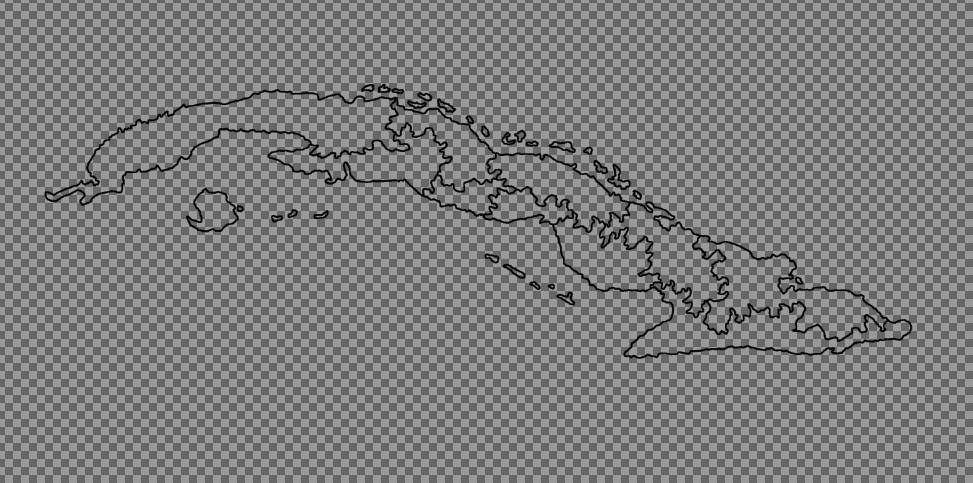
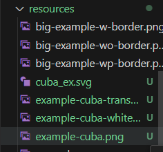
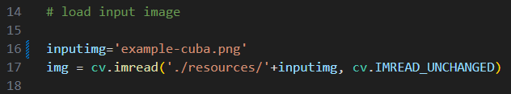
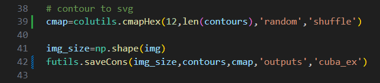
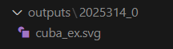
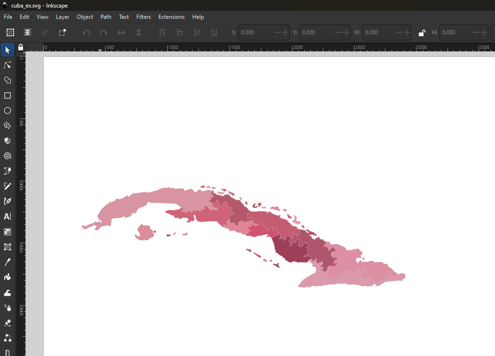

<h1>Chunk Map Separator</h1>

<cite>The good cartographer is both a scientist and an artist. </cite>
 <b>Erwin Josephus Raisz (1893 – 1968)</b>

 

  

Chunk Map Seprator is a convenient piece of software that can help with creating high-quality maps with beautiful procedurely generated color palattes. Primarily written in python, this software allows you to beautify your maps, create visually striking details and customize color palattes to your hearts content. <b>Note: This project is still WIP with many fetaures yet to come</b> 

<h2>Acknowledgements</h2>

- Vectorization algorithm: Heavily inspired by Dr. Tim A. Pastva's thesis "<a href = "https://calhoun.nps.edu/entities/publication/8126011c-a7ec-4cad-8372-4c971bf915a9">Bezier Curve Fitting</a>". <b>I have introduced some optimizations for his algorithms, for faster vectorization.</b>
    - Such as cachehing bernstein matrices to save compute on recalculating bernstien matrices each iteration.
    - And early termination techniques for results that achieve a certain level of tolerance.
- Curvature aware adaptive polygon segmentation: A multiple sources were used
    - Wikipedia's equations for <a href="https://en.wikipedia.org/wiki/Curvature#Plane_curves">planar curvature</a> were used to calculate the curvature of a raster curve in 2D plane.
    - The mulit-scalar curvature based segmentation was implemented from F. Mokhtarin's paper "<a href="https://ieeexplore.ieee.org/document/149591">A theory of multiscale, curvature-based shape representation for planar curves</a>".

<h2>Setup</h2>

I suggest you clone this repository and use Visual Studio Code as your IDE. Once successfullly cloned, create an empty <code>outputs</code> folder in your repository. 

<h2>Files</h2>

<h2>Workflow</h2>

For an example for the workflow, I will be using this map of Cuban Islands, I am currently working on.  

<h3>Loading a border map</h3>

For your first step, you should have a map with an transparent background and borders drawn in black color, as shown below. 

 

Save this file under any name you like in the <code>\\resources</code> folder. I've saved the image above as <code>example-cuba.png</code>. 

 

Assuming you have followed the above instructions to the dot, open <code>\\code\\main.py</code>.  
In the <code>main.py</code> code, locate <code>inputImg</code> variable and change the variable name to the file name of your border map. 

 

You have now, successfully loaded an image into the program.

<h3>Generating color palatte</h3>

This step requires some familiarity with color theory or atleast color wheel. If you are curious, I would suggest you checkout <a href="http://www.workwithcolor.com/hsl-color-picker-01.htm">this online color wheel</a>. Specifically, take note of hue values and their respective color.  

For this step, with reference to the color wheel, pick a hue alue of your choosing, 
Next up, you can change the sampling and picking parapmeters for <code>colutils.cmapHex()</code> functions. Here is a list of sampling and picking options. 

<b>Sampling:</b>
<ul>
<li>Linear: Generate hue, saturationand lightness values equidistant from one another</li>
<li>Random: Generate hue, saturation and lightness values randomly</li>
</ul>

<b>Picking</b>
<ul>
<li>Linear: Collate hue, saturation and lightness values as is</li>
<li>Random: Shuffle hue,saturation and lightness values before collating</li>
</ul>

If you prefer more randomness, pick both options to be Random. If you prefer a less chaotic color palatte, I would suggest you pick linear options. You are allowed to combine these as you please, so if you are not happy, then you try what combination works for you best.  

I have picked 12 as my hue value, "random" as my sampling procedure and "shuffle" as my picking procedure. Enter your values into the <code>colutils.cmapHex(..</code> line as shown below. 
 

<h3>Generating SVG</h3>

Finally, take a gander at the <code>futils.saveCons(..</code> line. The third and fourth parameters are for the output file location and output file name. As is seen in the last image, I will be saing to the outputs folder inside the repository, and I would be naming the file <code>cuba-ex</code>. 

You are now ready to run the <code>main.py</code> file. If all goes well, the python file should runwithout errors. You should be seeing an svg file under the folder <code>outputs</code> 
 

You can open the svg file with a web browser or any vector editor. I have opened the output file in Inkscape. 
 

<h2>TODO:</h2>

This project still very much WIP. There is plenty of more to add.

<ol start=1>
<li>On-Demand colormap: Spits out colors based on a hue value infinetely.</li>
<li>Easy color editing for an already saved SVG.</li>
<li>Rudimentary UI features.</li>
<li>Write SVG files compatible with inkscape layers.</li>
<li>On-click contour selection in-UI</li>
</ol>

 
<h2>References</h2>
<a href="https://www.w3.org/TR/SVG2/">SVG file definitions</a> 
<a href="https://en.wikipedia.org/wiki/HSL_and_HSV">HSL theory and HSl to RGB conversions</a>

